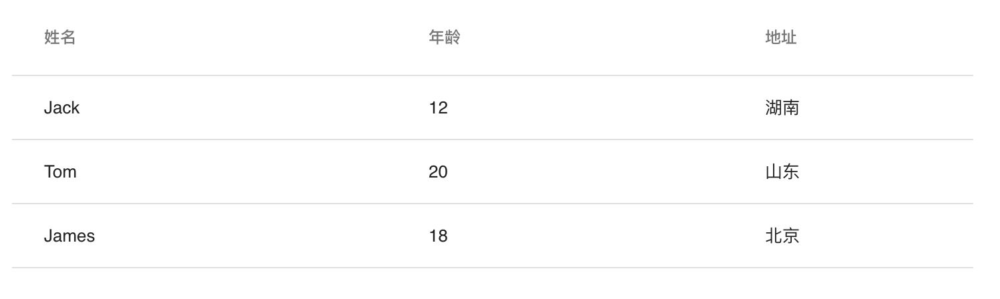

# Table
表格组件

## 使用示例
### 基本用法
```javascript
<Table
    columns={[
        {key: 'name', title: '姓名', dataIndex: 'name'},
        {key: 'age', title: '年龄', dataIndex: 'age'},
        {key: 'address', title: '地址', dataIndex: 'address'}
    ]}
    data={[
        {name: 'Jack', age: 12, address: '湖南'},
        {name: 'Tom', age: 20, address: '山东'},
        {name: 'James', age: 18, address: '北京'}
    ]}
    />
```



## props

|属性       |说明|示例|
|-|-|-|
|columns:Array      |表格的列|[{key: 'name', title: '姓名', dataIndex: 'name'},{key: 'age', title: '年龄', dataIndex: 'age'}]|
|columns[]:Object   |表格的一列, key:String 列ID,唯一字符串; title:String 列展示的字符; dataIndex:String 当前列的索引|{key: 'name', title: '姓名', dataIndex: 'name'}|
|data:Array         |表格的数据(依据columns)|[{name: 'Jack', age: 12, address: '湖南'},{name: 'Tom', age: 20, address: '山东'}]|
|data[]:Object      |表格一行的数据(依据columns),对象中的每个key代表columns中一列的dataIndex,value代表这行数据在该列的值|{name: 'Tom', age: 20, address: '山东'}|
|style:Object       |样式|与React中style相同|
|className:String   |类名|与React中className相同|
|pagination|分页控制，默认不显示分页器|{rowsPerPage: 5}|